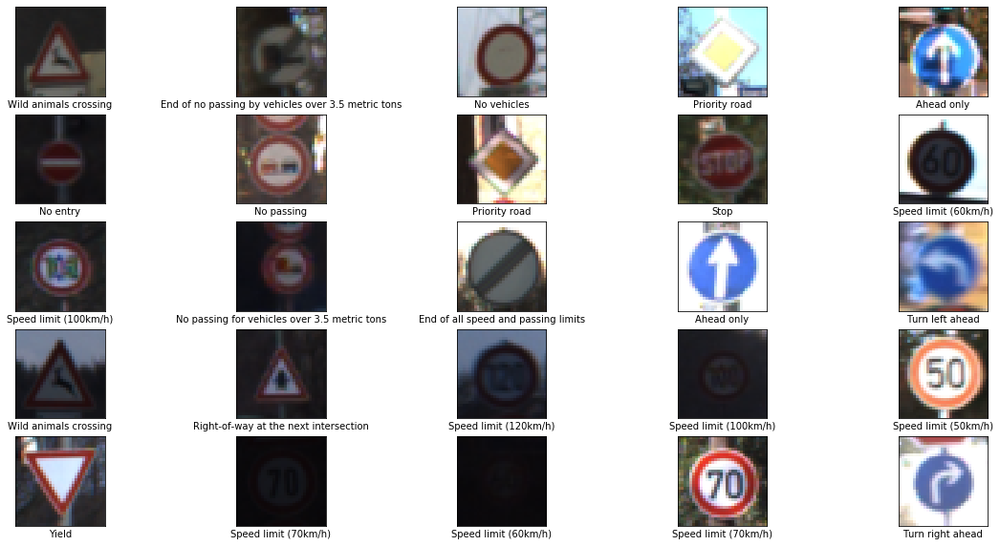
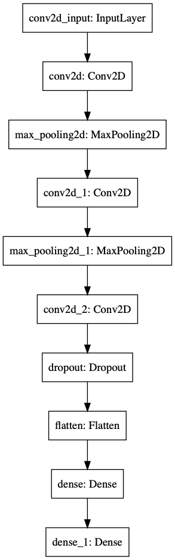
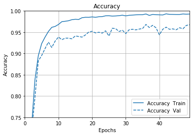
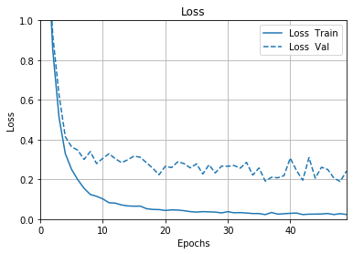
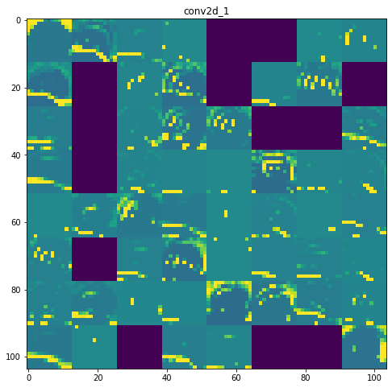

## Project: Build a Traffic Sign Recognition Program
[](http://www.udacity.com/drive)

Overview
---
In this project, We will use what you've learned about deep neural networks and convolutional neural networks to classify traffic signs. You will train and validate a model so it can classify traffic sign images using the [German Traffic Sign Dataset](http://benchmark.ini.rub.de/?section=gtsrb&subsection=dataset). After the model is trained, you will then try out your model on images of German traffic signs that you find on the web.


* More info about the project in the [writeup_template.md](https://github.com/chinmaydas96/CarND-Traffic-Sign-Classifier-Project/blob/master/writeup_template.md).


### Dependencies

#### For Plotting Following Library requres :

`pip install -q git+https://github.com/tensorflow/docs`

Other Dependency :

```
tensorflow-gpu===2.2.0
Pillow==6.2.1
pandas==1.0.3
matplotlib==3.2.1
numpy==1.18.4
```

### Dataset and Repository

1. Download the data set. [Link to the data](https://s3-us-west-1.amazonaws.com/udacity-selfdrivingcar/traffic-signs-data.zip). This is a pickled dataset in which we've already resized the images to 32x32. It contains a training, validation and test set.

2. Clone the project, which contains the Ipython notebook and the writeup template.

```sh
git clone https://github.com/udacity/CarND-Traffic-Sign-Classifier-Project
cd CarND-Traffic-Sign-Classifier-Project
jupyter notebook Traffic_Sign_Classifier.ipynb
```


# Project Description
---

### Dataset Visualize :



---

### Data Augmentation :

* Normaize the dataset
* Added Padding
* Random Crop to (32x32)
* Applied random brightness


---

### Model Architecture : 




### Evaluation of the model

#### Accuracy Plot : 




#### Loss Plot :




* Accuracy on Validation set : **0.9675**
* Accuracy on Test Set : **0.9589**


### Visualisation on Testset prediction


### Visualising Conv-net Featuremap




